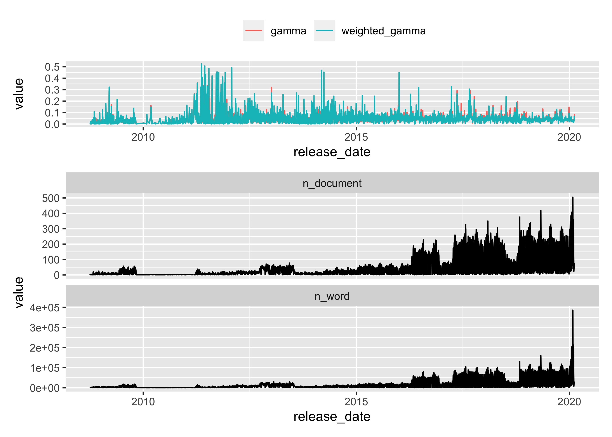
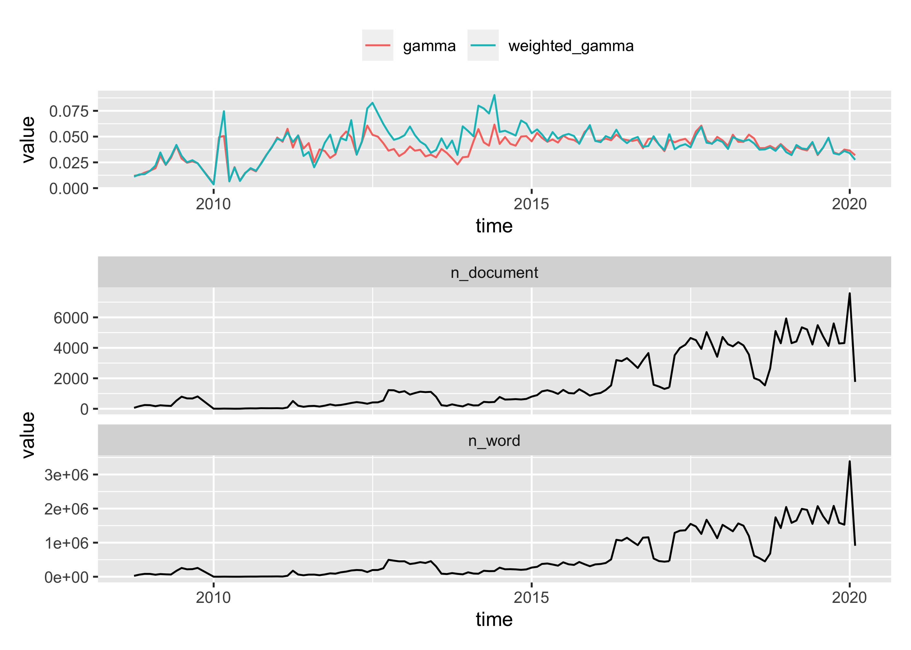

results
================

## Setup

``` r
library(tidyverse)
library(tidytext)
library(topicmodels)
library(stm)
library(quanteda)
library(granatlib)
```

``` r
news_df <- read_csv("data/us_equities_news_dataset.csv")
```

    ## Rows: 221513 Columns: 9
    ## ── Column specification ────────────────────────────────────────────────────────
    ## Delimiter: ","
    ## chr  (6): ticker, title, category, content, provider, url
    ## dbl  (2): id, article_id
    ## date (1): release_date
    ## 
    ## ℹ Use `spec()` to retrieve the full column specification for this data.
    ## ℹ Specify the column types or set `show_col_types = FALSE` to quiet this message.

``` r
load("data/dat_proc.RData")
```

``` r
fit_stm_df <- list.files("data/", full.names = TRUE) %>% 
  keep(str_detect, "fit_stm") %>% 
  enframe(NULL, "file_name") %>%
  transmute(
    k = parse_number(file_name),
    fit = map(file_name, ~ {load(.); mod})
  ) %>% 
  arrange(k)
```

``` r
fit_stm_df %>% 
  pull(fit, k) %>%
  imap(~ {
    broom::tidy(.x) %>% 
      group_by(topic) %>% 
      slice_max(beta, n = 5) %>% 
      summarise(term = str_c(term, collapse = ", ")) %>% 
      kable_output(caption = str_c("Terms with highest beta with ", .y, " topic"))
  })
```

$`2`

| topic |                term                |
|:------|:----------------------------------:|
| 1     | year, compani, earn, zack, quarter |
| 2     |  said, market, will, trade, year   |

Terms with highest beta with 2 topic

$`4`

| topic |                 term                  |
|:------|:-------------------------------------:|
| 1     |   said, will, compani, year, reuter   |
| 2     |  market, trade, week, percent, bank   |
| 3     | year, quarter, compani, million, earn |
| 4     |   stock, zack, compani, earn, rank    |

Terms with highest beta with 4 topic

$`6`

| topic |                   term                   |
|:------|:----------------------------------------:|
| 1     |    said, will, compani, reuter, year     |
| 2     |     market, will, year, price, bank      |
| 3     | compani, nasdaq, will, servic, technolog |
| 4     |  year, quarter, million, compani, earn   |
| 5     |   trade, percent, market, week, index    |
| 6     |    stock, zack, earn, compani, estim     |

Terms with highest beta with 6 topic

$`8`

| topic |                   term                   |
|:------|:----------------------------------------:|
| 1     |     said, reuter, bank, will, state      |
| 2     |  compani, product, will, energi, price   |
| 3     | compani, nasdaq, will, servic, technolog |
| 4     |      earn, zack, stock, estim, rank      |
| 5     |     market, stock, will, price, time     |
| 6     | year, quarter, million, revenu, compani  |
| 7     |   stock, compani, invest, zack, ratio    |
| 8     |   percent, trade, market, index, week    |

Terms with highest beta with 8 topic

$`10`

| topic |                   term                   |
|:------|:----------------------------------------:|
| 1     |    trade, nasdaq, stock, nyse, close     |
| 2     | compani, product, will, energi, industri |
| 3     |    said, reuter, state, year, govern     |
| 4     |  compani, drug, patient, medic, health   |
| 5     |     market, will, time, price, look      |
| 6     | year, quarter, million, revenu, compani  |
| 7     |      earn, zack, stock, estim, rank      |
| 8     |   percent, market, rate, expect, bank    |
| 9     |   compani, will, nasdaq, servic, appl    |
| 10    |   invest, stock, compani, fund, market   |

Terms with highest beta with 10 topic

$`12`

| topic |                  term                   |
|:------|:---------------------------------------:|
| 1     |    trade, nasdaq, stock, nyse, close    |
| 2     |  china, said, vehicl, chines, compani   |
| 3     |    said, reuter, bank, state, govern    |
| 4     | year, quarter, million, revenu, billion |
| 5     |     market, will, time, price, look     |
| 6     |  compani, growth, sale, retail, store   |
| 7     |  compani, drug, patient, medic, health  |
| 8     |   percent, market, bank, rate, expect   |
| 9     |   compani, nasdaq, will, servic, appl   |
| 10    |     earn, zack, estim, stock, rank      |
| 11    |  compani, energi, product, will, nyse   |
| 12    | stock, invest, investor, fund, compani  |

Terms with highest beta with 12 topic

$`14`

| topic |                   term                   |
|:------|:----------------------------------------:|
| 1     |    nasdaq, trade, nyse, close, stock     |
| 2     |  energi, product, price, compani, will   |
| 3     |    said, reuter, compani, state, will    |
| 4     |   quarter, year, million, revenu, earn   |
| 5     |      rate, will, year, china, bank       |
| 6     |  fund, invest, bank, compani, dividend   |
| 7     |  drug, compani, patient, medic, health   |
| 8     |  percent, market, expect, report, said   |
| 9     |      will, time, just, market, like      |
| 10    |     retail, store, sale, brand, food     |
| 11    |    compani, zack, growth, rank, stock    |
| 12    |      earn, stock, zack, estim, rank      |
| 13    | compani, nasdaq, appl, technolog, servic |
| 14    |     week, market, trade, stock, move     |

Terms with highest beta with 14 topic

$`16`

| topic |                   term                   |
|:------|:----------------------------------------:|
| 1     |    nasdaq, nyse, trade, share, close     |
| 2     |     vehicl, tesla, motor, said, auto     |
| 3     |    said, reuter, state, trump, govern    |
| 4     |    earn, estim, zack, quarter, stock     |
| 5     |     rate, market, year, will, expect     |
| 6     | year, quarter, million, revenu, billion  |
| 7     |  system, compani, health, will, defens   |
| 8     |    percent, trade, index, stock, rose    |
| 9     |    compani, appl, will, googl, amazon    |
| 10    |     retail, store, sale, brand, food     |
| 11    |   compani, growth, zack, market, rank    |
| 12    |  stock, zack, invest, industri, compani  |
| 13    |  energi, price, product, compani, year   |
| 14    |     market, time, week, trade, stock     |
| 15    |    fund, bank, invest, dividend, year    |
| 16    | drug, compani, patient, treatment, studi |

Terms with highest beta with 16 topic

$`18`

| topic |                   term                   |
|:------|:----------------------------------------:|
| 1     |    properti, real, estat, reit, citi     |
| 2     |    nasdaq, nyse, share, trade, stock     |
| 3     |   said, reuter, presid, state, execut    |
| 4     |    earn, quarter, estim, zack, report    |
| 5     |    rate, market, expect, month, will     |
| 6     | year, quarter, million, revenu, billion  |
| 7     |   energi, compani, nyse, product, will   |
| 8     |    percent, trade, index, rose, fell     |
| 9     |    compani, servic, appl, will, googl    |
| 10    |    retail, store, amazon, sale, game     |
| 11    |  compani, growth, market, busi, product  |
| 12    |    stock, zack, rank, year, industri     |
| 13    |   china, gold, chines, trade, countri    |
| 14    |     market, time, price, week, look      |
| 15    |    fund, bank, invest, dividend, year    |
| 16    | compani, drug, patient, medic, treatment |
| 17    |  stock, invest, zack, research, market   |
| 18    |   vehicl, said, tesla, compani, motor    |

Terms with highest beta with 18 topic

$`20`

| topic |                   term                    |
|:------|:-----------------------------------------:|
| 1     |    china, trade, chines, trump, tariff    |
| 2     |  health, medic, healthcar, care, nasdaq   |
| 3     |    game, year, netflix, first, disney     |
| 4     |    earn, quarter, estim, zack, report     |
| 5     |     rate, market, expect, month, week     |
| 6     |  year, quarter, million, revenu, billion  |
| 7     |    energi, will, product, nyse, airlin    |
| 8     |     percent, rose, point, fell, trade     |
| 9     |  compani, servic, will, technolog, googl  |
| 10    |    sale, retail, compani, store, brand    |
| 11    | invest, stock, zack, research, recommend  |
| 12    |    zack, compani, rank, stock, growth     |
| 13    |      market, time, will, just, look       |
| 14    |     nasdaq, nyse, stock, trade, share     |
| 15    |   fund, bank, invest, dividend, compani   |
| 16    | drug, compani, treatment, approv, patient |
| 17    |   stock, estim, current, investor, earn   |
| 18    |   vehicl, said, tesla, electr, compani    |
| 19    |    said, reuter, state, govern, presid    |
| 20    |    gold, price, compani, mine, product    |

Terms with highest beta with 20 topic

$`22`

| topic |                   term                    |
|:------|:-----------------------------------------:|
| 1     |   china, chines, trade, tariff, countri   |
| 2     | health, medic, nasdaq, healthcar, system  |
| 3     |    game, netflix, disney, year, first     |
| 4     |   quarter, earn, report, expect, share    |
| 5     |      rate, market, month, will, year      |
| 6     | bank, dividend, financi, compani, billion |
| 7     |   energi, will, product, compani, nyse    |
| 8     |     percent, rose, point, fell, trade     |
| 9     |  compani, servic, will, appl, technolog   |
| 10    |     retail, sale, store, amazon, home     |
| 11    |  compani, growth, product, market, busi   |
| 12    |   stock, year, valu, current, industri    |
| 13    |      market, will, like, time, just       |
| 14    |     nasdaq, nyse, stock, trade, close     |
| 15    |    invest, stock, zack, fund, research    |
| 16    | drug, patient, compani, treatment, approv |
| 17    |    earn, estim, zack, stock, consensus    |
| 18    |   vehicl, tesla, said, electr, compani    |
| 19    |    said, reuter, state, govern, trump     |
| 20    |     gold, trade, market, price, week      |
| 21    |    zack, rank, earn, quarter, compani     |
| 22    |   year, million, quarter, revenu, oper    |

Terms with highest beta with 22 topic

$`24`

| topic |                   term                   |
|:------|:----------------------------------------:|
| 1     |  airlin, steel, unit, travel, transport  |
| 2     |    nasdaq, nyse, share, stock, trade     |
| 3     |      game, first, point, year, said      |
| 4     |   share, report, quarter, expect, earn   |
| 5     |    rate, market, month, expect, data     |
| 6     |  compani, dividend, share, stock, cash   |
| 7     | health, system, medic, defens, healthcar |
| 8     |    percent, rose, trade, fell, point     |
| 9     |    will, year, netflix, stream, chief    |
| 10    |   sale, retail, store, compani, brand    |
| 11    |    compani, zack, growth, rank, stock    |
| 12    |   stock, invest, zack, valu, research    |
| 13    |      market, will, time, like, just      |
| 14    |   china, trade, chines, trump, tariff    |
| 15    |    bank, fund, invest, financi, asset    |
| 16    | drug, compani, patient, treatment, studi |
| 17    |    stock, zack, estim, current, year     |
| 18    |    vehicl, electr, tesla, will, motor    |
| 19    |   said, reuter, compani, state, govern   |
| 20    |  energi, price, product, gold, compani   |
| 21    |  earn, estim, zack, quarter, consensus   |
| 22    | year, million, quarter, revenu, billion  |
| 23    | compani, appl, technolog, servic, googl  |
| 24    |     week, trade, market, stock, move     |

Terms with highest beta with 24 topic

$`26`

| topic |                   term                   |
|:------|:----------------------------------------:|
| 1     | airlin, unit, travel, transport, flight  |
| 2     |   nasdaq, nyse, share, compani, stock    |
| 3     |   game, netflix, disney, stream, year    |
| 4     |  revenu, billion, expect, report, share  |
| 5     |    rate, expect, market, month, data     |
| 6     |   bank, dividend, financi, year, capit   |
| 7     | drug, compani, patient, medic, treatment |
| 8     |    trade, rose, percent, point, fell     |
| 9     |      will, time, like, just, think       |
| 10    |    said, state, govern, trump, reuter    |
| 11    |    compani, zack, growth, rank, stock    |
| 12    |   stock, year, investor, current, valu   |
| 13    |     week, market, trade, stock, move     |
| 14    |   china, trade, chines, trump, tariff    |
| 15    |   invest, stock, fund, zack, research    |
| 16    | appl, compani, technolog, nasdaq, servic |
| 17    |   option, trade, stock, volatil, share   |
| 18    |    price, target, read, analyst, rate    |
| 19    |    vehicl, tesla, will, motor, electr    |
| 20    |     gold, bond, market, bank, price      |
| 21    |    sale, retail, store, brand, amazon    |
| 22    |    year, quarter, million, oper, sale    |
| 23    | said, percent, compani, reuter, billion  |
| 24    |  energi, product, price, compani, natur  |
| 25    |  earn, estim, quarter, zack, consensus   |
| 26    |    home, properti, hous, real, estat     |

Terms with highest beta with 26 topic

$`28`

| topic |                    term                    |
|:------|:------------------------------------------:|
| 1     | airlin, unit, aircraft, transport, flight  |
| 2     |   nasdaq, technolog, nyse, tech, compani   |
| 3     |      game, point, first, year, disney      |
| 4     |  revenu, cloud, servic, softwar, compani   |
| 5     |     rate, market, expect, month, data      |
| 6     |   dividend, compani, share, incom, rate    |
| 7     |     compani, zack, rank, growth, stock     |
| 8     |     trade, stock, point, close, index      |
| 9     |      year, think, execut, chief, busi      |
| 10    |     said, state, reuter, govern, trump     |
| 11    |   stock, invest, zack, research, inform    |
| 12    |     stock, zack, year, estim, current      |
| 13    |      week, trade, market, stock, move      |
| 14    |    china, trade, chines, trump, tariff     |
| 15    |    fund, invest, year, investor, asset     |
| 16    | drug, compani, patient, treatment, approv  |
| 17    |    option, trade, volatil, stock, move     |
| 18    | product, industri, read, manufactur, price |
| 19    |     bank, said, billion, deal, financi     |
| 20    |      gold, mine, price, metal, silver      |
| 21    |   percent, said, analyst, share, expect    |
| 22    |  year, quarter, million, revenu, billion   |
| 23    |    compani, amazon, googl, servic, will    |
| 24    |    retail, sale, compani, store, brand     |
| 25    |     earn, estim, quarter, zack, stock      |
| 26    |   energi, price, product, compani, nyse    |
| 27    |     appl, vehicl, compani, tesla, said     |
| 28    |       market, will, time, like, just       |

Terms with highest beta with 28 topic

$`30`

| topic |                   term                    |
|:------|:-----------------------------------------:|
| 1     | airlin, unit, aircraft, transport, flight |
| 2     |   nasdaq, technolog, share, nyse, chip    |
| 3     |      game, year, point, first, said       |
| 4     |    revenu, billion, year, share, busi     |
| 5     |   bank, dollar, market, euro, european    |
| 6     |  dividend, compani, bank, financi, share  |
| 7     |    compani, zack, growth, rank, stock     |
| 8     |    trade, point, stock, close, nasdaq     |
| 9     |      will, market, time, just, like       |
| 10    |    said, trump, presid, state, govern     |
| 11    |   stock, invest, zack, research, secur    |
| 12    |   stock, current, zack, industri, valu    |
| 13    |     week, market, stock, trade, move      |
| 14    |   china, trade, chines, tariff, global    |
| 15    |    fund, invest, investor, year, asset    |
| 16    | drug, compani, patient, treatment, studi  |
| 17    |    option, trade, volatil, stock, move    |
| 18    |    vehicl, tesla, motor, auto, electr     |
| 19    |    said, bank, compani, billion, deal     |
| 20    |     gold, price, mine, metal, silver      |
| 21    |   earn, report, expect, quarter, share    |
| 22    |    year, million, quarter, oper, sale     |
| 23    |   retail, store, amazon, compani, onlin   |
| 24    |    compani, brand, food, sale, consum     |
| 25    |   earn, zack, estim, quarter, consensus   |
| 26    |   energi, product, price, compani, nyse   |
| 27    |  appl, compani, technolog, googl, nasdaq  |
| 28    |    rate, year, month, economi, econom     |
| 29    |    said, compani, reuter, court, rule     |
| 30    |   percent, said, reuter, market, share    |

Terms with highest beta with 30 topic

``` r
fit_stm14 <- fit_stm_df %>% 
  pull(fit, k) %>% 
  .[["14"]]
```

``` r
plot(fit_stm14, type = "summary")
```

<!-- -->

``` r
labelTopics(fit_stm14)
```

    ## Topic 1 Top Words:
    ##       Highest Prob: nasdaq, trade, nyse, close, stock, point, share 
    ##       FREX: wynn, releasenow, moex, melco, bottler, tlri, aphria 
    ##       Lift: aavl, abgb, acbff, acrgf, actua, adat, adial 
    ##       Score: nasdaq, rose, barrel, fell, ounc, index, outnumb 
    ## Topic 2 Top Words:
    ##       Highest Prob: energi, product, price, compani, will, year, natur 
    ##       FREX: shale, missil, refineri, permian, exxonmobil, cubic, petrobra 
    ##       Lift: aalesund, abakan, abdullatif, abimael, abkhazia, abqaig, abroadth 
    ##       Score: barrel, energi, crude, shale, saudi, opec, steel 
    ## Topic 3 Top Words:
    ##       Highest Prob: said, reuter, compani, state, will, unit, execut 
    ##       FREX: lawyer, attorney, prosecutor, sedan, takata, spacex, planemak 
    ##       Lift: aaib, aarup, aascu, abdirizak, abdulmajid, abdulrehman, abdurrahman 
    ##       Score: said, reuter, told, court, percent, tesla, spokesman 
    ## Topic 4 Top Words:
    ##       Highest Prob: quarter, year, million, revenu, earn, report, share 
    ##       FREX: guidancefor, outlookfor, combinationher, flowa, rpms, saysaccord, updatea 
    ##       Lift: abkatun, absg, acano, ackland, acquisitiondur, acquisitions, acquisitionsdur 
    ##       Score: quarter, zack, revenu, consensus, million, earn, segment 
    ## Topic 5 Top Words:
    ##       Highest Prob: rate, will, year, china, bank, market, economi 
    ##       FREX: ecri, riksbank, debas, bullion, scandi, wlig, forint 
    ##       Lift: aaccord, abct, abdygulov, abeth, abquaia, ackerlof, adem 
    ##       Score: gold, bond, bank, monetari, rate, economi, inflat 
    ## Topic 6 Top Words:
    ##       Highest Prob: fund, invest, bank, compani, dividend, year, asset 
    ##       FREX: underwrit, reinsur, vornado, aimco, annali, bancorpsouth, gerspach 
    ##       Lift: aagpx, abalx, abhyx, abthx, abysx, acchx, accl 
    ##       Score: dividend, fund, bank, ratio, loan, yield, asset 
    ## Topic 7 Top Words:
    ##       Highest Prob: drug, compani, patient, medic, health, treatment, approv 
    ##       FREX: cancer, therapi, clinic, amgen, bristol, diabet, biosimilar 
    ##       Lift: aaaabkbzciwgggngni, aaha, aaic, aamt, aapm, aasld, abacavir 
    ##       Score: drug, cancer, treatment, therapi, patient, diseas, pharmaceut 
    ## Topic 8 Top Words:
    ##       Highest Prob: percent, market, expect, report, said, month, index 
    ##       FREX: nikkei, stoxx, seng, kospi, ibex, topix, currenciesth 
    ##       Lift: abberg, abovenet, accordng, accordong, acto, advancestock, affairson 
    ##       Score: percent, euro, nikkei, index, rose, crude, fell 
    ## Topic 9 Top Words:
    ##       Highest Prob: will, time, just, market, like, think, year 
    ##       FREX: analystokay, officeryeah, yeah, officerthank, analystthank, operatorthank, phonet 
    ##       Lift: abigaildisney, abra, accyy, acebook, activehotel, actx, adamje 
    ##       Score: disney, bitcoin, question, realli, think, buffett, chief 
    ## Topic 10 Top Words:
    ##       Highest Prob: retail, store, sale, brand, food, home, consum 
    ##       FREX: groceri, mortar, athlet, pizza, championship, touchdown, dunkin 
    ##       Lift: abalon, abhijith, accelerateth, acciari, acclam, accordino, acucar 
    ##       Score: store, retail, restaur, brand, comp, food, walmart 
    ## Topic 11 Top Words:
    ##       Highest Prob: compani, zack, growth, rank, stock, market, nyse 
    ##       FREX: hyatt, viasat, vickeri, trima, microinvert, crealogix, calgon 
    ##       Lift: accelerategross, accura, acetaldehyd, achx, acquisitionc, acquisitionsfollow, acquisitionslast 
    ##       Score: zack, rank, growth, stock, compani, custom, moreov 
    ## Topic 12 Top Words:
    ##       Highest Prob: earn, stock, zack, estim, rank, compani, current 
    ##       FREX: unmanag, releasechicago, contactzack, newsmani, garp, ratioa, ratioanoth 
    ##       Lift: accelerationearn, addthank, aemcolo, aerovironmentwhil, agrowth, algnin, alibabath 
    ##       Score: zack, rank, earn, consensus, stock, estim, ratio 
    ## Topic 13 Top Words:
    ##       Highest Prob: compani, nasdaq, appl, technolog, servic, will, googl 
    ##       FREX: smartphon, server, android, xiaomi, handset, whatsapp, encrypt 
    ##       Lift: ablegam, achal, activex, adaski, adelberg, adnroid, adultswin 
    ##       Score: googl, appl, facebook, cloud, user, netflix, smartphon 
    ## Topic 14 Top Words:
    ##       Highest Prob: week, market, trade, stock, move, high, price 
    ##       FREX: overbought, oversold, macd, trendlin, retest, bartosiak, bolling 
    ##       Lift: ablemarket, aboveretail, abreakout, acrophobia, actionforex, admati, aeroviro 
    ##       Score: trader, chart, resist, index, bearish, week, overbought

``` r
cloud(fit_stm14, topic = 2)
```

<!-- -->

``` r
findThoughts(fit_stm14, texts = news_df$content[- dat.proc$docs.removed], n = 5, topics = 2)$docs[[1]] %>% 
  gsub(pattern = "Now read$", replacement = "") %>% 
  plotQuote(width = 60)
```

<!-- -->

``` r
gamma_df <- fit_stm14 %>% 
  broom::tidy("gamma")
```

``` r
news_gamma_df <- news_df %>% 
  mutate(t = as.numeric(release_date - min(release_date))) %>% 
  select(release_date, t, content) %>% 
  slice(- dat.proc$docs.removed) %>% 
  select(release_date, t, content) %>% 
  bind_cols(
    broom::tidy(fit_stm14, "gamma") %>% 
      filter(topic == 2)
  )
```

``` r
word_gamma_df <- news_gamma_df %>% 
  select(release_date, gamma, document, content) %>% 
  unnest_tokens("word", "content") %>% 
  filter(str_length(word) >= 4)
```

``` r
daily_gamma_df <- word_gamma_df %>% 
  group_by(release_date) %>% 
  summarise(
    weighted_gamma = mean(gamma), # weighted by n words
    gamma = mean(ifelse(!duplicated(document), gamma, NA), na.rm = TRUE),
    n_word = n(),
    n_document = n_distinct(document)
  )
```

``` r
library(patchwork)
p1 <- daily_gamma_df %>% 
  select(release_date, weighted_gamma, gamma) %>% 
  pivot_longer(- release_date) %>% 
  ggplot(aes(release_date, value, color = name)) + 
  geom_line() + 
  labs(color = NULL) +
  theme(legend.position = "top")

p2 <- daily_gamma_df %>% 
  select(release_date, n_word, n_document) %>% 
  pivot_longer(- release_date) %>% 
  ggplot(aes(release_date, value)) + 
  facet_wrap(~ name, ncol = 1, scales = "free_y") + 
  geom_line()

patchwork::wrap_plots(p1, p2, ncol = 1, heights  = c(1, 3))
```

<!-- -->

``` r
mothly_gamma_df <- word_gamma_df %>%
  mutate(time = lubridate::floor_date(release_date, "month")) %>% 
  group_by(time) %>% 
  summarise(
    weighted_gamma = mean(gamma), # weighted by n words
    gamma = mean(ifelse(!duplicated(document), gamma, NA), na.rm = TRUE),
    n_word = n(),
    n_document = n_distinct(document)
  )
```

``` r
p1 <- mothly_gamma_df %>% 
  select(time, weighted_gamma, gamma) %>% 
  pivot_longer(- time) %>% 
  ggplot(aes(time, value, color = name)) + 
  geom_line() + 
  labs(color = NULL) +
  theme(legend.position = "top")

p2 <- mothly_gamma_df %>% 
  select(time, n_word, n_document) %>% 
  pivot_longer(- time) %>% 
  ggplot(aes(time, value)) + 
  facet_wrap(~ name, ncol = 1, scales = "free_y") + 
  geom_line()

patchwork::wrap_plots(p1, p2, ncol = 1, heights  = c(1, 3))
```

<!-- -->

``` r
# TODO fittness
```
